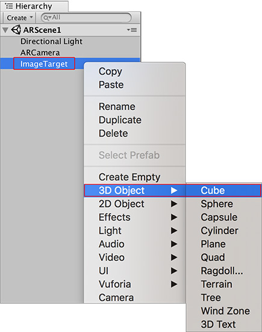
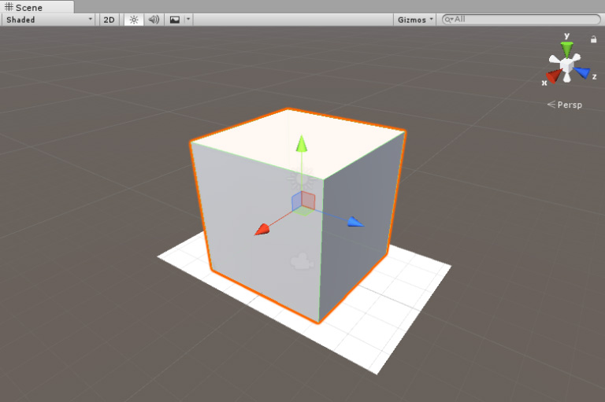
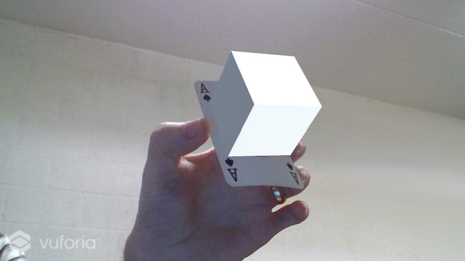

# Displaying 3D models on top of tracked images

This page shows you how to display a GameObject when the camera recognizes and tracks an on-screen Image Target. 

Make the GameObject a child of the Image Target GameObject. This child GameObject must contain both a __MeshRenderer__ and __MeshFilter__ component. 

Add a Cube Primitive as a child to your Image Target GameObject. To do this, right-click it and select __3D Object__ &gt; __Cube__ from the pop-up menu.

Now scale the Cube GameObject, and move it closer to your Image Target GameObject to make it look like it is sitting on the Target image. Use the __Scene view__ to judge the position of the GameObject. If you used the same __Width__ as the playing card in this guide, then change the X, Y and Z Scales of the GameObject’s Transform component to 0.5 and change the __Transform Position__ Y value to 0.25 to make it sit well on the Image Target GameObject. 

Your Scene should look something like this:

Click the Unity Editor Play button to test the AR functionality. When you place the image in front of the webcam, the Cube appears on top of the image in the __Game__ view. 

The Camera component on the __ARCamera__ has its default __Far Clipping Planes__ set to 2000. For games or applications which require image tracking at larger distances (such as those requiring AR or MR glasses), you need to adjust the __Far Clipping Planes__ for the __Camera__ component in Unity, and increase the size of the Targets to ensure the device camera can easily track them.

You have now successfully made a simple app that uses an Image Target, and displays a basic 3D shape in its place once the camera can track it.

---
* 2018-03-28 <!-- include IncludeTextNewPageYesEdit -->

* Vuforia documentation updated for Unity XR API in 2017.3