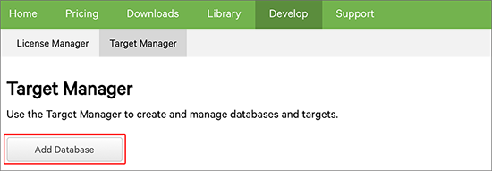
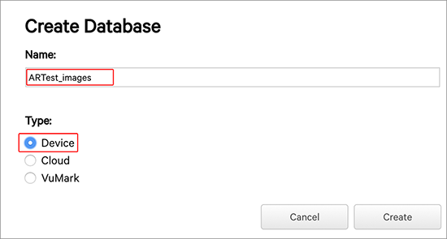
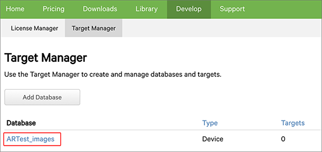
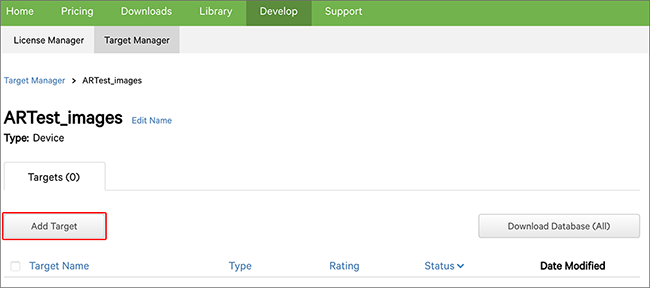
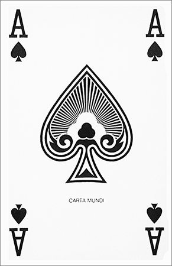
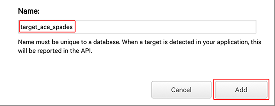
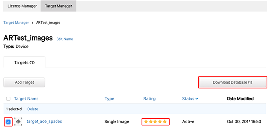
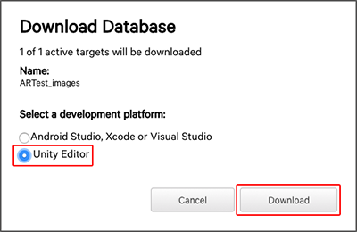

# Setting up Image Targets

This section shows you how to set up a simple Image Target and get it responding to basic tracking events.

To allow your application to recognize images and use them as Targets to trigger gameplay, display graphics or information, you need to create a __Target database__. You can create Target databases directly from the Vuforia Developer Portal [Target Manager](https://developer.vuforia.com/Target-manager) page, as the steps in this section describe.

Log into your [Vuforia Developer account](https://developer.vuforia.com/user/login). Then navigate to the [Target Manager](https://developer.vuforia.com/Target-manager) page and click on the __Add Database__ button.

On the __Create Database__ page, type a name for your database, select __Device__ from the __Type__ options, then click the __Create__ button. 

This adds the new Target database to the __Target Manager__ list. Now click on the __Database name__ in the list to open the __Device Database list__.

This brings you to the __Target list__ page for the database, where you can add new Targets and download the database in specific formats for use with several platforms. Click the __Add Target__ button to open the __Add Target__ popup window.

The __Add Target__ window presents you with options to specify details about the Target you want to add. There are four different types of [Targets](https://library.vuforia.com/articles/Solution/Targets.html) you can add: Single Image, Cuboid/Box, Cylinder and 3D Object. Under __Type__, Select __Single Image__ and browse your hard drive to locate the image you want to use as an Image Target. 

This example uses a playing card to demonstrate the Image Target recognition capabilities in Unity. 

Use any image, but make sure that the image has enough detail to be rated as a 5-star Target so that the camera can easily track it. 

The __Width__ value is a scale value that you need to set to the size you want the image to appear in your Unity Scene (in real-world units). Unity measures everything in your Scene in relation to the size of your Target image. For this example, the width of the playing card is 5.5cm, so you would use _5.5cm_ as the __Width__ value. If you need a larger size Target, then increase this __Width__.

Enter a name for the Target image, and click the __Add__ button to upload the Image Target to the database.

The image appears in the list of Targets with a __Rating__ value represented by stars. If your __Rating__ is less than 5 stars, it may be harder for the camera to track it. To learn more about what affects Image Target ratings, see Vuforia documentation on [Optimizing target detection and tracking stability](https://library.vuforia.com/articles/Solution/Optimizing-Target-Detection-and-Tracking-Stability.html).

Once you are satisfied with your image's Rating, select the checkbox to the left of the __Image Target__ name and click the __Download Database__ button.

On the __Download Database__ window, under __Select a development platform__, select __Unity Editor__, then click the __Download__ button. This downloads a Unity package of the Target database that you can save on your hard drive.

Switch back to your Unity project to import the Unity package for use in your application.

---
* 2018-03-28 <!-- include IncludeTextNewPageYesEdit -->

* Vuforia documentation updated for Unity XR API in 2017.3