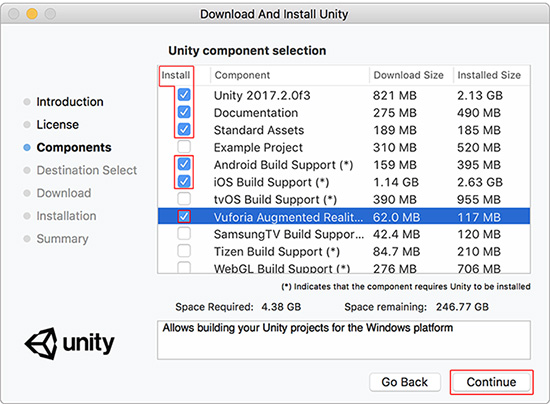
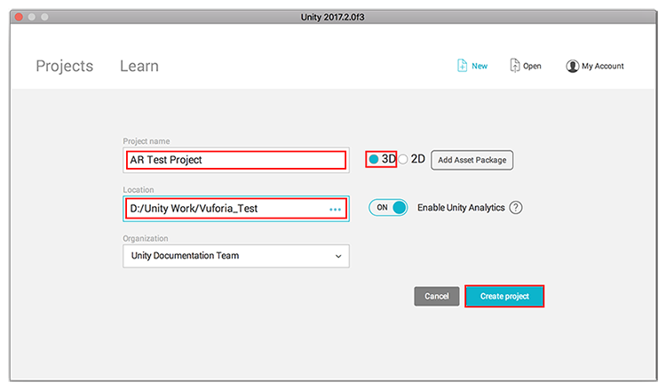
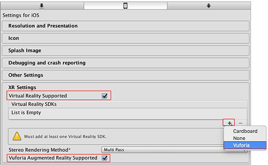
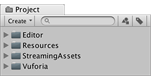
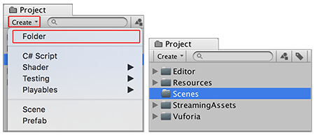
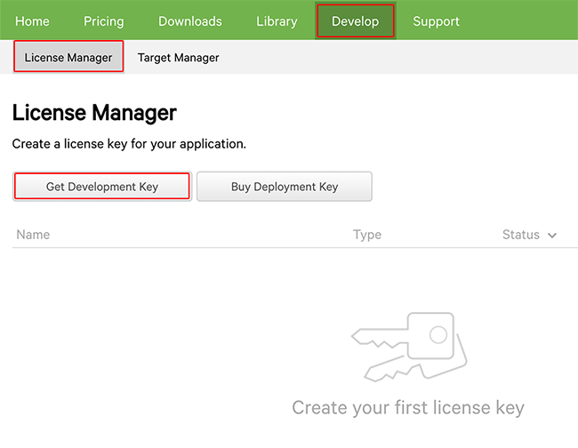
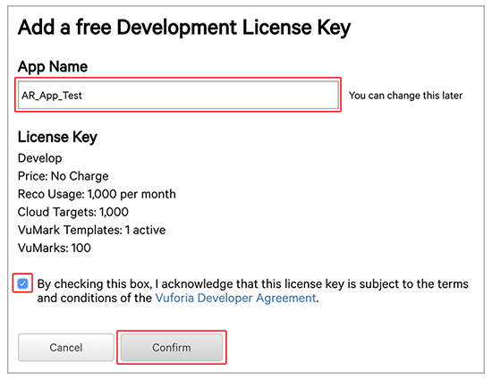
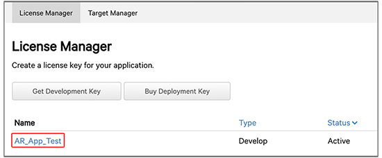
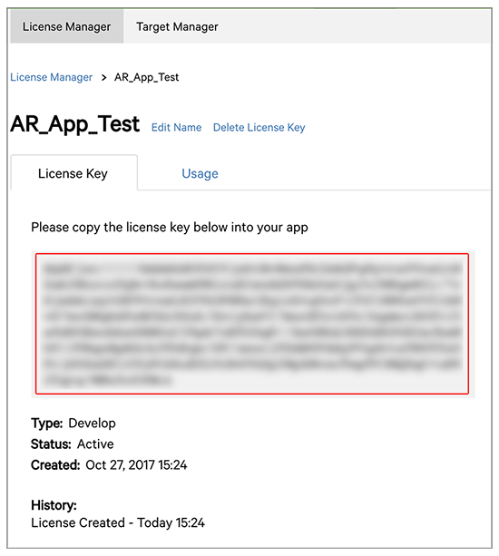
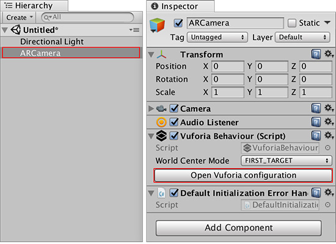

# Setting up your Project for Vuforia

Setting up your project to develop Vuforia AR or MR mobile applications is very similar to the set-up process for building with Unity for a mobile platform. The Unity Installer includes the Vuforia SDK. Follow the instructions for downloading and installing Unity on the [InstallingUnity](InstallingUnity) manual page. Vuforia provides a selection of Prefabs designed to be dropped into a Scene to provide feature functionality to your application. These are all available from inside the Unity Editor.

You should adhere to the same performance considerations as required for developing regular mobile games. For information on optimising for mobile devices, see Unity documentation on [mobile optimisation](MobileOptimisation).

To get Vuforia set up with Unity:

* Install the [latest version of Unity](https://unity3d.com/get-unity/download), and in the Unity component selection section of the installer, select __Vuforia Augmented Reality Support__, along with either the __iOS Build Support__ or __Android Build Support__ packages.

**Note:** Most AR and MR applications target mobile devices, so the focus of this guide is development for Android and iOS. See guides for enabling build support for Android and iOS devices in the Getting Started documentation for [Android](android-GettingStarted) and [iOS](iphone-GettingStarted).

* Create a Vuforia developer account from the [Vuforia registration page](https://developer.vuforia.com/user/register). This account gives you access to the tools you need to make AR and MR applications with Vuforia in Unity.

* If you have not already created a Unity ID, then do so from the [Unity registration page](https://id.unity.com/en/conversations/8c075ba1-a442-41b1-b64d-ad4fb3c56073008f?view=register). You need a Unity ID to download any packages from the Unity Asset Store.

* Open Unity and create a new 3D Project (make sure the __3D__ option is selected next to the __Add Asset Package__ button). Name your Project, then click the __Create project__ button.

**Tip:** Download the [Vuforia AR+VR Sample package](https://www.assetstore.unity3d.com/en/#!/content/101547) from the Unity Asset Store. This package provides useful example Scenes demonstrating important features. You will not need this for following this guide, but it is useful to have for further learning later.

## Activating Vuforia in Unity

To activate Vuforia in your Unity project, access the **Player** settings from __Edit__ &gt; __Project Settings__, then select the __Player__ category, and select the tab for the mobile device you are building to. Under the __XR Settings__ panel, enable the __Vuforia Augmented Reality Support__ property.

Your Scene now contains two GameObjects: a main Camera, and a directional light. You need to add a new AR Camera to the Scene in order to enable AR functionality, and you need to delete the current __Main Camera__ GameObject from the Scene. 

To delete the Camera GameObject, select it in the __Hierarchy window__ and press the delete key on your keyboard, or right click it and select __Delete__.

For more information on the individual settings under the **XR Settings** panel, see the [Vuforia Platform Configuration](vuforia_configuration) page of this manual.

## Adding a Vuforia AR Camera and other GameObjects

To add an AR Camera to your scene, go to __GameObject__ &gt; __Vuforia__ &gt; __AR Camera__. 

If this is the first Vuforia GameObject added to your Scene then Unity also prompts to import your Vuforia Assets. Select __Import__, and Unity imports all necessary Vuforia files into your project.

The __Project window__ displays 4 new folders, one of which is called __Vuforia__. The code and Assets in this folder provide the main AR and MR functionality. The other folders provide sample Scenes, resources, tools, and plugins so that you can develop AR and MR applications for a variety of devices.

Create a new folder in your project. To do this, navigate to the Project window, click the __Create__ button, and select __Folder__. Name this new folder _Scenes_ and save a [new Scene](CreatingScenes) inside this folder.

This process also adds a new ARCamera GameObject in your Scene hierarchy.

## Creating a Vuforia license key

The last step in the setup process is to create a license key from the [License Manager section](https://developer.vuforia.com/Targetmanager/licenseManager/licenseListing) of the Vuforia Developer Portal. You need to enter this into Unity's Vuforia configuration settings in order to build and test your application with Unity. 

Visit the [Vuforia Developer Portal](https://developer.vuforia.com/user/login) and log in (or create a new account). Navigate to the __License Manager__ in the __Develop__ section and click the __Get Development Key__ button to open the __Add License Key__ page.

On the __Add License Key__ page, enter a name for your app. Accept the terms and conditions, then click the __Confirm__ button to generate a new license key.

On the next page, agree to the Vuforia Developer conditions (tick the box) and then click the __Confirm__ button. This brings you back to the __Licence Manager__ page where you can see your newly created license in a list where its status is __Active__. Click on the name of your App to view the license details. This allows you to retrieve your development license key.

Copy the license key to the clipboard and navigate back to your Unity Project.

Select the __ARCamera__ GameObject from the __Hierarchy window__ and, in the Inspector window, navigate to the the __Vuforia Behaviour(Script)__ component and click the __Open Vuforia configuration__ button. 

The __Inspector window__ displays a list of __Vuforia Configuration__ options. Paste your Vuforia Development key into the __App License Key__ text box under the Vuforia section and then click the __Add License__ button.

## Testing your set-up

To test Vuforia apps in the Unity Editor, you need to have a webcam connected to your PC or laptop. As a final step to make sure Vuforia is now installed properly in your Unity Project, press the __Play__ button to test your Scene. If Vuforia is set up correctly, a video feed from your webcam appears in the Editor Game View. 

Now you are ready to set up Image Targets and add AR functionality to your Project.

---
* 2018-03-28 <!-- include IncludeTextNewPageYesEdit -->

* Vuforia documentation updated for Unity XR API in 2017.3