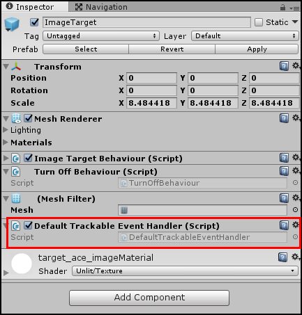
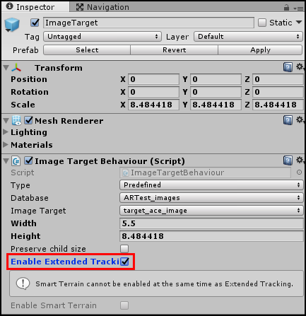

# Vuforia tips, troubleshooting and resources

This page provides useful tips to help you make AR/MR applications with Vuforia in Unity.

## Image Target tracking

When a camera is tracking an Image Target in the in-Editor Play mode, Unity disables all components belonging to the Image Target GameObject’s child GameObjects. This does not include any Script components attached to the child GameObjects of the Image Target GameObject. Any Scripts continue to run even when the Image Target is not in view. This might require you to do conditional checks to prevent any code in the Script’s `Update()` method constantly running if you don't need it. Alternatively, you can disable the Script component in code, and re-enable it whenever it is needed again.

## Running code during Image Target state change events

A useful script for running code during specific Image Target tracking event states (such as whether the target is visible or not) is the __Default Trackable Event Handler (Script)__ component attached to each Image Target GameObject.



Here are two of the most useful methods:

```
private void OnTrackingFound()
```

Unity calls this method from the __Default Trackable Event Handler (Script)__ component of the specific instance of an Image Target GameObject when Vuforia finds it in the __Camera view__. This method is very useful for running specific code at the very beginning of tracking an object (such as adding the GameObject to a list of active GameObjects).

```
private void OnTrackingLost()
``` 

Unity calls this method from the __Default Trackable Event Handler (Script)__ component of the specific instance of an Image Target GameObject when Vuforia loses track of an Image Target from the Camera view. This method is very useful for running specific code as soon as an Image Target disappears from view (such as removing the GameObject from a list in your GameManager keeping track of all GameObjects active in your application).

## Extended Tracking

For Image Targets that only require an initial setup and registration, and do not require images to be constantly tracked, navigate to the Target's __Image Target Behaviour (Script)__ component and enable the __Enable Extended Tracking__ option. 



__Enable Extended Tracking__ allows positions and orientations of Image Targets to persist even when not in view of the Camera (after the camera has recognized them at least once) and uses features of the environment to improve tracking performance. More detailed information on Extended Tracking with Vuforia is available in the Vuforia documentation on [extended tracking](https://library.vuforia.com/articles/Training/Extended-Tracking).

## Publishing your AR/MR application

To export your Vuforia AR or MR application from Unity to mobile platforms, use the same steps as when normally publishing to Android or iOS devices. See documentation on publishing for these platforms:

* [Publishing to Android](class-PlayerSettingsAndroid)
* [Publishing to iOS](class-PlayerSettingsiOS)

No special settings are required.

## Useful links

Here are some useful resources and tutorials to help you learn more about the many features available with Vuforia.

* [Unity Vuforia forums](https://forum.unity.com/forums/vuforia.138/)

* [Vuforia Developer Forums](https://developer.vuforia.com/forum)

* Vuforia documentation: [Vuforia Developer Library](https://library.vuforia.com/)

* Vuforia documentation: [Best practices for mixed reality AR/VR experiences](https://library.vuforia.com/articles/Best_Practices/Best-practices-for-hybrid-VRAR-experiences.html)

## Troubleshooting guides

This section provides links to useful troubleshooting information for the most common problems you may encounter when developing with the Vuforia SDK.

* [Vuforia Developer Portal: FAQ]([https://developer.vuforia.com/forum/faq/faq](https://developer.vuforia.com/forum/faq/faq)

---
* <span class="page-edit">2018-03-28 <!-- include IncludeTextNewPageYesEdit --></span>

* <span class="page-history">Vuforia documentation updated for Unity XR API in 2017.3</span>