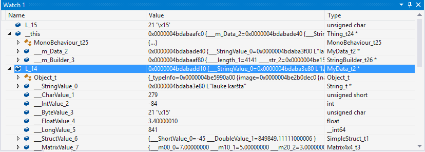
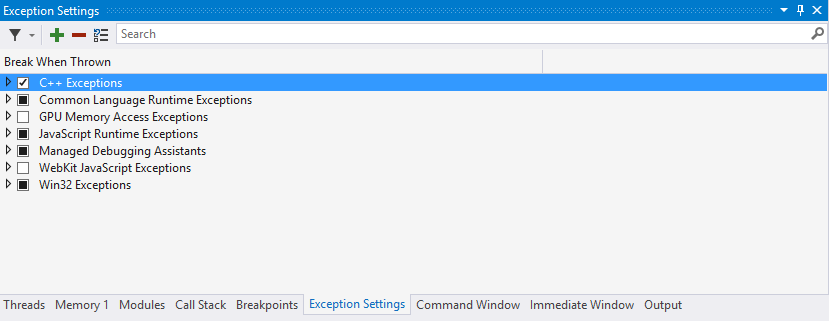
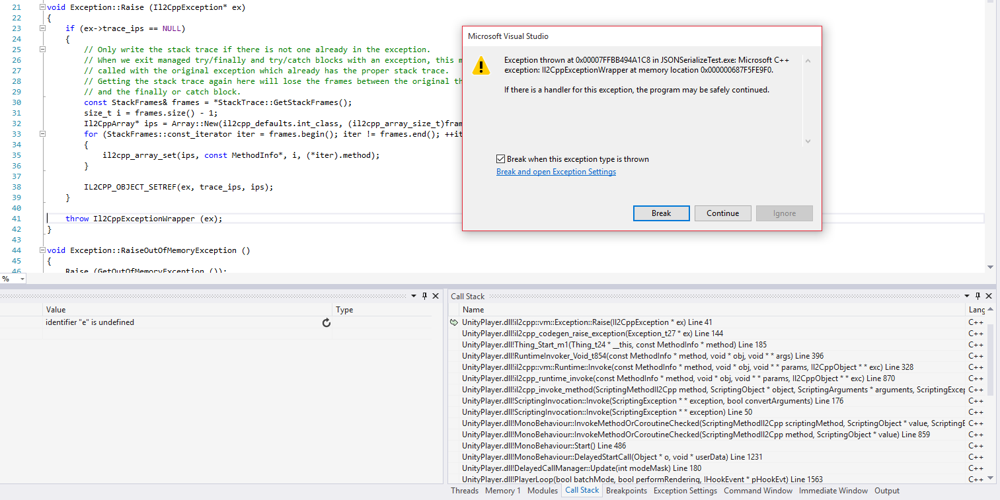

#Universal Windows Platform: Debugging on IL2CPP Scripting Backend

## Debugging C# code

To debug C# code with IL2CPP, enable __Script Debugging__ in the [Build Settings](BuildSettings) before building the Project, and enable the __InternetClient__, __InternetClientServer__ and __PrivateNetworkClientServer__ capabilities in the [Player settings](class-PlayerSettingsWSA) or the manifest. The manifest is not overwrriten when you build on top of a previous build, so if you want to change the capabilities, you need to do it from Visual Studio manifest editor.

The debugging procedure is the same as any other Unity platform. For more information, see [Debugging C# code in Unity](ManagedCodeDebugging).

## Debugging generated C++ code

In addition to debugging C# code, you can debug generated C++ code using Visual Studio. 

## Class and method naming in generated C++ code

IL2CPP classes look like this: ```<ClassName>_t#number```, where ```<ClassName>``` is plain name of a class, while #number is a unique type number. #number is not present on some of the core types. For example:

    String_t
    Object_t
    Type_t
    Char_t34
    StringBuilder_t26
    GuidParser_t1539
    
IL2CPP methods look like this: ```<ClassName>_<MethodName>_m#number```, where ```<ClassName>``` is the plain class name of methods declaring type, ```<MethodName>``` is a plain method name and ```#number``` is unique method number. For example:

    GuidParser_ParseHex_m10003
    ConfigurationSection_DoDeserializeSection_m1275
    String_Format_m4102
    Mathf_Sqrt_m289
    Thing_Start_m1

Static field structures are named like this: ```<ClassName>_t#number_StaticFields```, where the first part of the structure name is identical to the declaring type, for example:

    StringBuilder_t26_StaticFields
    Thing_t24_StaticFields
    
Furthermore, above each class/method definition there is a C++ comment stating full class/method name. For example:

    // System.String
    struct String_t : public Object_t
    {
    	// System.Int32 System.String::length
    	int32_t _length_0;
    	// System.Char System.String::start_char
    	uint16_t _start_char_1;
    };
    
    // System.Text.StringBuilder
    struct StringBuilder_t26  : public Object_t
    {
    	// System.Int32 System.Text.StringBuilder::_length
    	int32_t length_1;
    	// System.String System.Text.StringBuilder::_str
    	String_t* str_2;
    	// System.String System.Text.StringBuilder::_cached_str
    	String_t* cached_str_3;
    	// System.Int32 System.Text.StringBuilder::_maxCapacity
    	int32_t maxCapacity_4;
    };
    
    // System.Void MyData::.ctor()
    extern "C" void MyData_ctor_m0 (MyData_t2 * this, const MethodInfo* method)
    {
        ...
    }

    // Thing
    struct Thing_t24 : public MonoBehaviour_t25
    {
    	// MyData Thing::m_Data
    	MyData_t2 * _m_Data_2;
    	// System.Text.StringBuilder Thing::m_Builder
    	StringBuilder_t26 * _m_Builder_3;
    };
    struct Thing_t24_StaticFields
    {
    	// System.Int32 Thing::s_SomeStaticField
    	int32_t _s_SomeStaticField_4;
    };

## Observing variable values

One of the most important parts of debugging is observing values of various variables. Visual Studio allows to do that relatively easily by either mousing over the variable of adding it into the watch window. For example:




Observing static fields is a little bit harder. In IL2CPP, static fields are stored on a Il2CppClass instance itself. So in order to observe a static field, we'll first need a pointer to Il2CppClass structure of that type. These pointers are in scope of methods that use them, but after observing it once, it will remain at the same memory address for the duration of application run. Il2CppClass structure has "static_fields" field, which is a pointer to a memory block containing static fields for that particular type. To view the actual values, this pointer has to be cast to appropriate static field structure: each type has its own. For example, let's observe the static fields of class ```Thing_t24```:


## Investigating exceptions

IL2CPP uses native C++ exceptions to implement .NET exceptions. When any exception is supposed to be thrown, IL2CPP throws Il2CppExceptionWrapper object, which is defined as the following:

    struct Il2CppExceptionWrapper
    {
    	Il2CppException* ex;
    
    	Il2CppExceptionWrapper (Il2CppException* ex) : ex (ex) {}
    };

These exception objects can be easily investigated in the watch window:


Lastly, it might be beneficial to enable debugger-break on exception so the source of the exception can be caught red-handed. To do so, hit CTRL+ALT+E in Visual Studio, and make sure that C++ exceptions checkbox is checked in the opened window:



After enabling this setting, Visual Studio will automatically stop execution whenever an exception is thrown:



---
* <span class="page-edit">• 2018-10-18  <!-- include IncludeTextAmendPageNoEdit --></span>

* <span class="page-history">C# debugging for IL2CPP on Universal Windows Platform added in [2018.2] (https://docs.unity3d.com/2018.2/Documentation/Manual/30_search.html?q=newin20182) <span class="search-words">NewIn20182</span></span>
