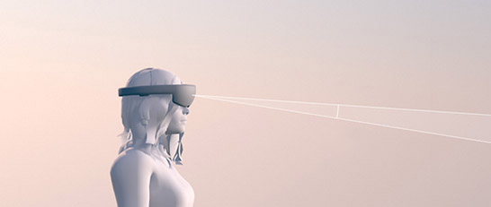
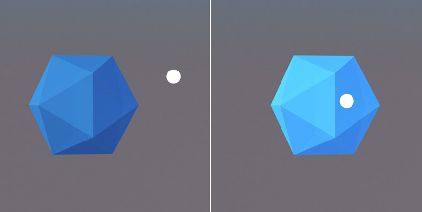
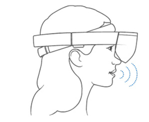
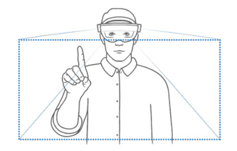
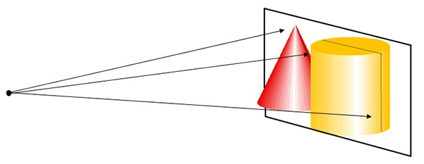
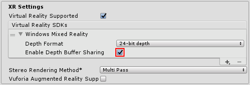

# WMR input and interaction concepts

All Windows Mixed Reality devices use specific forms of interaction to take input from the user. Some of these forms of input are specific to certain Windows Mixed Reality devices, such as HoloLens or immersive headsets.

Immersive headsets use a variety of inputs, including spatial controllers. HoloLens is limited to using 3 forms of input, unless extra hardware is required by the application to be used in addition to the headset.

All forms of input work with Windows Mixed Reality immersive headsets. Gaze works in VR, gestures trigger when you use the Select button on the controller, and voice is available when the end user has a microphone connected to their PC.

Input on HoloLens is different from other platforms because the primary means of interaction are:

1. __Gaze__: Controls the application by tracking where the user is looking in the world.
2. __Voice__: Short, spoken commands, and longer free-form dictation, which can be used to issue commands or trigger actions.
3. __Gesture__: Hand signals or controller input trigger commands in the system.

## Gaze (all devices)

Gaze is an input mechanism that tracks where a user is looking:

On HoloLens, this is accurate enough that you can use it to get users to select GameObjects in the world. You can also use it to direct commands at specific GameObjects rather than every GameObject in the Scene.

For more information, see Microsoft's documentation on [Gaze indicator](https://dev.windows.com/en-us/holographic/gaze_indicator) and [Gaze targeting](https://developer.microsoft.com/en-us/windows/mixed-reality/gaze_targeting).

## Voice (all devices)

Windows 10 API provides voice input on both HoloLens and immersive devices. Unity supports three styles of input:

* __Keywords__: Simple commands or phrases (set up in code) used to generate events. This allows you to quickly add voice commands to an application, as long as you do not require localization. The [KeywordRecognizer](ScriptRef:Windows.Speech.KeywordRecognizer.html) API provides this functionality.

* __Grammars__: A table of commands with semantic meaning. You can configure grammars through an XML grammar file (.grxml), and localize the table if you need to. For more information on this file format, see Microsoft’s documentation on [Creating Grammar Files](https://msdn.microsoft.com/en-us/library/ms873278.aspx). The [GrammarRecognizer](ScriptRef:Windows.Speech.GrammarRecognizer.html) API provides this functionality.

* __Dictation__: A more free-form text-to-speech system that translates longer spoken input into text. To prolong battery life, dictation recognition on the HoloLens is only active for short periods of time. It requires a working Internet connection. The [DictationRecognizer](ScriptRef:Windows.Speech.DictationRecognizer.html) API provdes this functionality.

HoloLens headsets have a built in microphone, allowing voice input without extra hardware. For an application to use voice input with immersive headsets, users need to have an external microphone connected to their PC.

For more information about voice input, refer to Microsoft’s documentation on [Voice design](https://dev.windows.com/en-us/holographic/Voice_design).

## Gestures (all devices)

A gesture is a hand signal interpreted by the system or a controller signal from a Spatial Controller. Both HoloLens and immersive devices support gestures. Immersive devices require a spatial controller to initiate gestures, while HoloLens gestures require hand movement. You can use gestures to trigger specific commands in your application. 

Windows Mixed Reality provides several built-in gestures for use in your application, as well as a generic API to recognize custom gestures. Both built-in gestures and custom gestures (added via API) are functional in Unity.

For more information, see Microsoft's documentation on [gestures](https://developer.microsoft.com/en-us/windows/mixed-reality/gestures).

## Focus Point (all devices)

Windows Mixed Reality uses a process called Late Stage Reprojection 9LSR) to compensate for movement of the user’s head between the time a frame is rendered and when it appears on the display. To compensate for this latency, LSR modifyies the rendered image according to the most recent head tracking data, then presents the image on the display.

The HoloLens uses a stabilization plane for reprojection (see Microsoft documentation on [plane-based reprojection](https://developer.microsoft.com/en-us/windows/mixed-reality/hologram_stability#stabilization_plane)). This is a plane in space which represents an area where the user is likely to be focusing. This stabilization plane has default values, but applications can also use the [SetFocusPoint](ScriptRef:XR.WSA.HolographicSettings.SetFocusPointForFrame.html) API to explicitly set the position, normal, and velocity of this plane. Objects appear most stable at their intersection with this plane. Immersive headsets also support this method, but for these devices there is a more efficient form of reprojection available called [per-pixel depth reprojection](https://developer.microsoft.com/en-us/windows/mixed-reality/hologram_stability#stabilization_plane).

Desktop applications using immersive headsets can enable per-pixel depth reprojection, which offers higher quality without requiring explicit work by the application. To allow per-pixel depth reprojection, open the Player Settings for the Windows Mixed Reality, go to __XR Settings &gt; Virtual Reality SDKs__ and check __Enable Depth Buffer Sharing__.

When __Enable Depth Buffer Sharing__ is enabled, ensure applications do not explicitly call  the `SetFocusPoint` method, which overrides [per-pixel depth reprojection](https://developer.microsoft.com/en-us/windows/mixed-reality/hologram_stability#stabilization_plane) with [plane-based reprojection](https://developer.microsoft.com/en-us/windows/mixed-reality/hologram_stability#stabilization_plane).

__Enable Depth Buffer Sharing__ on HoloLens has no benefit unless you have updated the device’s OS to Windows 10 Redstone 4 (RS4). If the device is running RS4, then it determines the stabilization plane automatically from the range of values found in the depth buffer. Reprojection still happens using a stabilization plane, but the application does not need to explicitly call `SetFocusPoint`.

For more information on how the HoloLens achieves stable holograms, see Microsoft’s documentation on [hologram stability](https://dev.windows.com/en-us/holographic/Hologram_stability.html#Stabilization_Plane).

## Anchors (HoloLens only)

Anchor components are a way for the virtual world to interact with the real world. An anchor is a special component that overrides the position and orientation of the Transform component of the GameObject it is attached to.

### WorldAnchors

A WorldAnchor represents a link between the device’s understanding of an exact point in the physical world and the GameObject containing the WorldAnchor component. Once added, a GameObject with a WorldAnchor component remains locked in place to a location in the real world, but may shift in Unity coordinates from frame to frame as the device’s understanding of the anchor’s position becomes more precise.

Some common uses for WorldAnchors include:

* Locking a holographic game board to the top of a table.

* Locking a video window to a wall.

Use WorldAnchors whenever there is a GameObject or group of GameObjects that you want to fix to a physical location.

WorldAnchors override their parent GameObject’s Transform component, so any direct manipulations of the Transform component are lost. Similarly, GameObjects with WorldAnchor components should not contain Rigidbody components with dynamic physics. These components can be more resource-intensive and game performance will decrease the further apart the WorldAnchors are. 

__Note__: Only use a small number of WorldAnchors to minimise performance issues. For example, a game board surface placed upon a table only requires a single anchor for the board. In this case, child GameObjects of the board do not require their own WorldAnchor.

For more information and best practices, see Microsoft’s documentation on [spatial anchors](https://developer.microsoft.com/en-us/windows/mixed-reality/spatial_anchors).

---
* 2018-03-27 <!-- include IncludeTextNewPageYesEdit -->

* New content added for XR API changes in 2017.3
