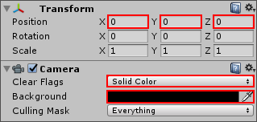
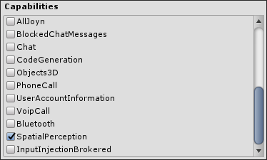
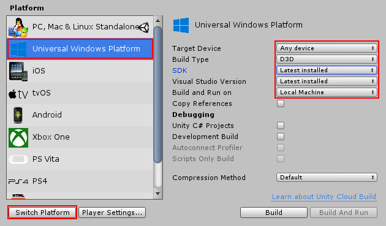
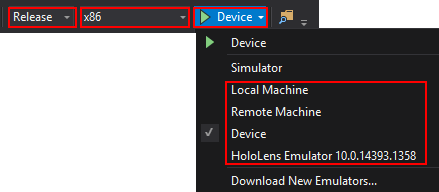

# *WMR* quick start guide

Windows Mixed Reality (WMR) applications are Universal Windows Applications, and follow the same general guidelines as other [Windows Store applications](windowsstore-gettingstarted). The development environment is Visual Studio 2017, and does not require an additional SDK installation (Visual Studio installs the necessary SDKs).

## Installing required tools

You must install a number of tools on your PC and headset before you can develop Windows Mixed Reality applications. These tools include:

* [Visual Studio 2017](https://www.visualstudio.com/downloads/) with required workloads installed (Universal Windows Platform development and Game development with Unity).

* [HoloLens Emulator and Holographic Templates](https://go.microsoft.com/fwlink/?linkid=852626) (Only required for HoloLens development).

To ensure that you install all of the required tools for developing Windows Mixed Reality applications (on both HoloLens and immersive headsets) follow the instructions from Microsoft’s documentation on [Installing the Tools](https://developer.microsoft.com/en-us/windows/mixed-reality/install_the_tools).

For detailed information on developing for Windows Mixed Reality, see [Microsoft’s WMR documentation](https://developer.microsoft.com/en-us/windows/mixed-reality/development_overview).

After you have installed the required tools, follow the short guide below to set up a Unity project and publish on Windows Mixed Reality devices.

## Project set up

A Unity project for Windows Mixed Reality is very similar to a Unity project for other platforms, with a few notable exceptions. To fully support Windows Mixed Reality features, you need to change camera, performance and publishing settings as outlined in the following sections. 

### Camera settings

Ensure that the __Tag__ for the Camera you intend to use to track the HMD’s position is set to __MainCamera__. To check this, select the Camera you want to use, and in the Inspector window, see the __Tag__ drop-down. Unity automatically applies this tag to the default Camera in the Scene. 

For HoloLens , set the __Clear Flags__ property of the __Main Camera__ to __Solid Color__ rather than the default __Skybox,__ and set the __Background__ color to black (R = 0, G = 0, B = 0, A = 0). You should also make sure the Camera’s __Transform__ position is set to (0, 0, 0).

### Performance settings

For HoloLens only, use the __Fastest__ quality setting in __Edit__ &gt; __Project Settings__, then select the __Quality__ category. This maximizes performance and reduces power consumption. In particular, avoid soft shadows and shadow cascades, because they require too many resources to use on the HoloLens.

To learn more about optimizing your Windows Mixed Reality application, see Microsoft’s documentation on [Performance recommendations for Unity](https://dev.windows.com/en-us/holographic/Performance_recommendations_for_Unity).

### Publishing settings

To enable important system capabilities for a Windows Mixed Reality application, go to the __Publishing Settings__ panel of the __Player__ settings and check the box for each option you want to use from the __Capabilities __list.

__Note:__ Not all of the publishing settings in the __Capabilities__ list are specific to Windows Mixed Reality. For more information, see the [Player settings for the Universal Windows platform](class-PlayerSettingsWSA).

The following table describes the important capability settings for publishing Windows Mixed Reality applications:

| __Capability Setting__| __Immersive headset support__ | __HoloLens support__ |  __Description__ |
|:---|:---|:---|:---|
| __InternetClient__| Y | Y | Provides access to your Internet connection for outgoing connections to the Internet. WMR requires this for voice recognition. |
| __InternetClientServer__| Y | Y | Provides access to your Internet connection, including incoming unsolicited connections from the Internet. The app can send information to or from your computer through a firewall. WMR requires this for voice recognition.  Note: If this is active, you don't need to use __InternetClient__. |
| __MusicLibrary__| Y | N | Provides access to your music library and playlists, including the capability to add, change, or delete files. This allows you to use __VideoCapture__ audio recording functionality in your WMR app. |
| __PicturesLibrary__| Y | Y | Your picture library, including the capability to add, change, or delete files. This capability also includes pictures libraries on HomeGroup computers, along with picture file types on locally connected media servers. |
| __VideosLibrary__| Y | N | Your video library, including the capability to add, change, or delete files. This capability also includes video libraries on HomeGroup computers, along with video file types on locally connected media servers. |
| __WebCam__| N | Y | Allows you to use __PhotoCapture__ and __VideoCapture __functionality in your app. |
| __Microphone__| Y | Y | Allows you to use voice recognition functionality in your app. |
| __Bluetooth__| Y | Y | Enables bluetooth communication in your app. WMR requires this to allow you to use Windows Mixed Reality spatial controllers. |
| __SpatialPerception __| N | Y | Allows you to use [Spatial Mapping](SpatialMapping) in your app. |

For more detail on these capabilities, see the [Microsoft documentation](https://docs.microsoft.com/en-us/uwp/schemas/appxpackage/appxmanifestschema/element-capability).

## Exporting a Visual Studio solution

When you have created your project and are ready to test it, export the project to a Visual Studio solution. To deploy your WMR application you must first build a Visual Studio solution with Unity.

Go to __File__ &gt; __Build Settings__ and select __Universal Windows Platform__ from the __Platform__ list. Now click the __Switch Platform__ button at the bottom left of the window to configure the Editor to build for Windows. 

For a standard build, the default settings work correctly for Windows Mixed Reality immersive headsets. 

To build for HoloLens, you should change the __Target Device__ setting to __HoloLens__.

The table below provides a list of the Build Settings available for the Universal Windows Platform and describes their usage.

| **Setting** ||**Description** |
|:---|:---|:---|
| __Target Device__|| Choose __Any Device__ to build for immersive headsets and __HoloLens__ to build for HoloLens. This is important for optimisation. |
|__Build Type__||Choose from D3D (Direct3D) or XAML.|
|| __D3D__| Gives faster results than XAML because there is no XAML layer in the app. This builds the app in 3D exclusive space, and you can’t switch to a 2D XAML app or modify this after generation. |
|| __XAML__| Adds an XAML code layer over the app, which allows the user to switch from the 3D app and open a 2D app. XAML code can be modified after generation. The most common example of this is using a touch keyboard for the HoloLens. |
| __SDK__||Select the specific version of Windows 10 SDK your app uses.  This is set to __Latest installed__ by default. |
| __Visual Studio Version__|| Select the specific version of Visual Studio to generate a solution (.sln) for. This is set to __Latest installed__ by default, which is the recommended setting if you have Visual Studio 2017 installed. |
| __Build and Run on__|| Choose which device your application runs on when you click the __Build and Run__ button. This is set to __Local Machine__ by default, and you should not need to change this.  __Note__: Unity ignores this option when you click the __Build __button.  |
| __Copy References__|| Enables copying of UnityPlayer.dll, associated dlls and data to the generated solution folder instead of referencing them directly from Unity installation folder. This requires extra space, but enables the generated solution to be portable (you can copy it to another machine and build it even if Unity is not installed on that machine).|
| __Unity C# Projects__|| Allows inclusion of the scripting files from your project in the generated solution. This setting is only available when you set the __Scripting Backend__ to __.NET__.  |
| __Development Build__|| Unlocks debug features and allows developers to test and debug built projects. This allows you to connect the built project to the Unity profiler, and provides other development features such as more verbose debug log outputs. Enabling this setting also makes the __Scripts Only Build__ and __Autoconnect Profiler__ settings available.|
| __Autoconnect Profiler__|| Allow Unity's built-in profiler to automatically connect to the build. This is only available when __Development Build__ is enabled. |
| __Scripts Only Build__|| Build only the scripts of a project. This is only available when __Development Build__ is enabled. |

Before you can build your app, you should configure your **Player** settings to build Windows Mixed Reality applications correctly:

1. From the Build Settings window, click the __Player Settings__ button, and then naigate to the __XR Settings__ panel.

2. Enable __Virtual Reality Supported__.

3. Click the __+__ button on the __Virtual Reality Devices__ list and select __Windows Mixed Reality__.

After you have configured your Build Settings, click the __Build__ button. Build your project to a new folder and remember the location. 

To deploy your app from Visual Studio, do the following:

1. In Visual Studio, open the generated solution file (.sln) located inside the folder where you built your project.

2. In the main Visual Studio taskbar (left to right in image below), change the target platform for your solution, and select which device to run the solution on. 
  
    

3. Click the dropdown arrow on the right of the Run button (marked by a green arrowhead) and a list of possible devices will appear. 

There are four main options to test and run your Windows Mixed Reality application from Visual Studio: 

* __Local Machine__ 
* __Remote Machine__
* __Device__
* __HoloLens Emulator__

The sections below describe these options in more detail. Not all of these options work for all WMR devices; some are specific to HoloLens or immersive headsets.

### Local Machine (immersive headsets only)

__Local Machine__ allows you to build your application and install it to the Mixed Reality Portal on your Windows 10 PC. When built, your app automatically runs on your PC, and you can test it through your immersive headset.

You can launch your application again at any time through the Start menu from the Mixed Reality Portal.

### Remote Machine (HoloLens only)

__Remote Machine__ prompts you to enter the IP address of the HoloLens or other headset you wish deploy to. When you click __Run__ with __Remote Machine__ selected, a dialog box asks you for a PIN for the device. 

To get this PIN:

1. Switch on your HoloLens and go to __HoloLens Settings__. 

2. Select the __For Developers__ tab and enable __Developer Mode__ using the provided toggle button.

3. Select the __Pair__ button to get the __PIN__ and enter it into Visual Studio in the popup box.

Your application remote installs onto your HoloLens and, when the build process is complete, runs on the device automatically.

### Device (HoloLens only)

__Device__ allows you to build your Visual Studio project and deploy it to a HoloLens device connected to your PC via a USB cable. 

When you click __Run__, Visual Studio builds the project, installs the app on the connected HoloLens, and runs on the device automatically once the build process is complete.

### HoloLens Emulator (HoloLens only)

__HoloLens Emulator__ allows you to build the Visual Studio project and run the app on an installed HoloLens emulator. This emulator lets you test your app and simulate gestures and other inputs on your PC before you deploy it to a HoloLens device.

### Including Scripts in your generated solution (optional)

Tick the __Unity C# Projects__ checkbox to include the scripting files from your project in the generated solution. This allows you to edit and debug your scripts without needing to re-export from Unity. You only need to re-export when your **Project Settings** or content change. This setting is only available when you set the __Scripting Backend__ to __.NET__. 

You can use either __IL2CPP__ or __.NET__ scripting backends for your application. To change the __Scripting Backend__, navigate to the __Other Settings__ panel on the __Player__ settings and select the relevant backend in the __Configuration__ section.

For more information on ILCPP, see Unity's documentation on [How IL2CCP works](IL2CPP-HowItWorks).

For more information on building to Windows Mixed Reality devices, see Microsoft’s documentation on [Exporting and building a Unity Visual Studio solution](https://dev.windows.com/en-us/holographic/Exporting_and_building_a_Unity_Visual_Studio_solution).

---
* 2018-03-27 <!-- include IncludeTextNewPageYesEdit -->

* New content added for XR API changes in 2017.3
