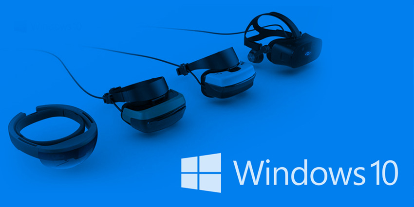
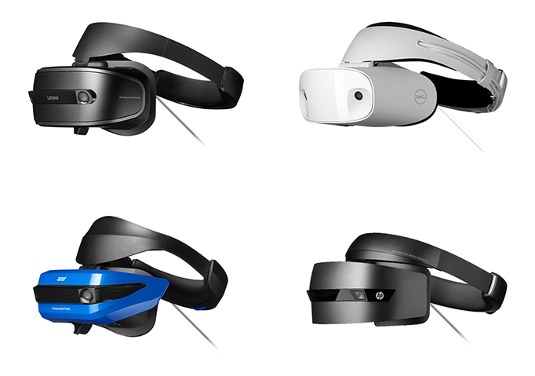
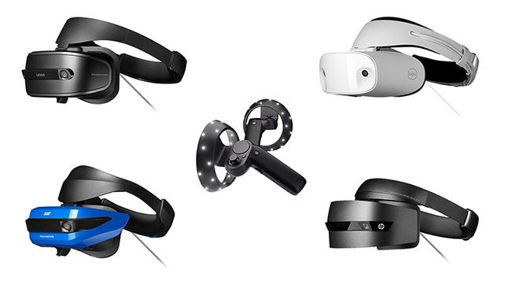

# Windows Mixed Reality

Windows Mixed Reality (WMR) is a Microsoft platform built around the Windows 10 API, allowing applications to render digital content on holographic and immersive display devices.

##Holographic and immersive headsets
Holographic devices such as the Microsoft HoloLens allow you to see the physical environment around you while wearing the headset, blending the real world with virtual content.

Windows Mixed Reality immersive headsets feature an opaque display to block out the physical world and surround you in a 360 degree virtual environment.

###HoloLens

The HoloLens is a device for running both Augmented Reality and Mixed Reality applications. There are a number of important differences between HoloLens and Windows immersive devices, which developers should consider when creating applications. While HoloLens applications use the same tools and APIs as other Windows Mixed Reality applications, their strength lies in allowing you to interact with the real world environment in unique ways.

#### What are holograms?

HoloLens renders 3D virtual objects in your device’s view, creating the illusion that those objects are in the surrounding real-world environment. The user can interact with these objects using gestures, voice commands and gaze. The objects can also interact with real-world surfaces in your physical environment. You can attach audio, animations and other components to holograms, as with any other GameObject in Unity. 

More information on holograms is available on the [Microsoft developer website](https://developer.microsoft.com/en-us/windows/mixed-reality/hologram).

###Immersive headsets

Windows Mixed Reality (WMR) immersive headsets feature an opaque display to block out the physical world and surround you in a 360 degree virtual environment. 

Many Virtual Reality devices, such as the HTC Vive or Oculus Rift, use sensors built into headsets and cameras facing towards these to track user movements. This is known as outside-in tracking. The majority of WMR immersive headsets use inside-out tracking: Instead of using external cameras in the environment, inside-out tracking devices use outward-facing cameras built into the headset for positional tracking. Windows Holographic devices such as the HoloLens also use inside-out tracking.

### Differences between Holographic and immersive devices

The table below presents the main features of Holographic and immersive Windows Mixed Reality devices.

| __Feature__| __Holographic device__ | __Immersive device__ |
|:---|:---|:---| 
| __Display__| See-through display that allows you to see the physical environment while wearing the headset | Opaque display that blocks out the physical environment while wearing the headset |
| __Tracking Scale__| World scale | Stationary or Room scale |
| __Tracking type__| Inside-out | Inside-out |
| __Headsets__|  |   |

The table below lists the important differences between Hololens and immersive devices.

| __Difference__|__Details__|
|:---|:---|
| __Holograms do not replace reality__| Unlike an immersive 3D environment, holograms are additive; the device draws them over the real world. HoloLens applications augment and can interact with your physical environment.|
| __Input paradigms are different__| The primary forms of input for HoloLens are:  - __Gaze__ (where the user is looking)  - __Gesture__ (hand signals that the device interprets as commands)  -  __Voice__ (spoken commands).  This is a significant shift from conventional input methods.|
| __The HoloLens device is power sensitive__| HoloLens is a mobile device, so applications need to be responsible with power usage, just like a phone app. Ensuring you disable features and optimize for CPU utilization is more important than on other platforms.  |
| __Photo capture and video capture__| Only HoloLens allows the user to capture pictures and videos from the device’s camera. Immersive Windows Mixed Reality headsets don’t allow the user to access the cameras on the device to capture photos or videos. Using the photo and video capture APIs will allow you to capture from a webcam connected to your PC. |
| __Spatial Mapping__| HoloLens supports spatial mapping components and APIs. Windows Mixed Reality immersive headsets do not support these. |
| __Tracking Space__| Immersive devices work best for standing-scale (stationary) or room-scale experiences, while the HoloLens works at world scale. Users are not limited to a single location, and can walk far beyond their initial location. Applications need to deal with dynamic reference frames and world-locked content. |

For information about input control mapping differences, see [Windows Mixed Reality Input](wmr_input_types).

You can also find additional details in [Microsoft’s Mixed Reality documentation](https://developer.microsoft.com/en-us/windows/mixed-reality/mixed_reality).

---
* 2018-03-27 <!-- include IncludeTextNewPageYesEdit -->

* New content added for XR API changes in 2017.3
