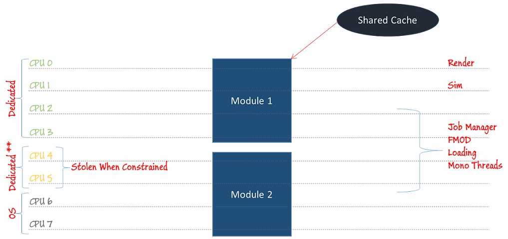
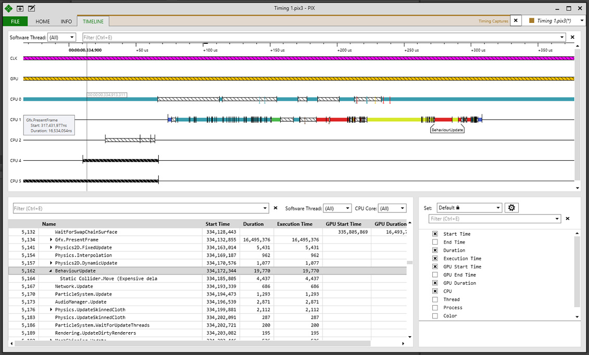
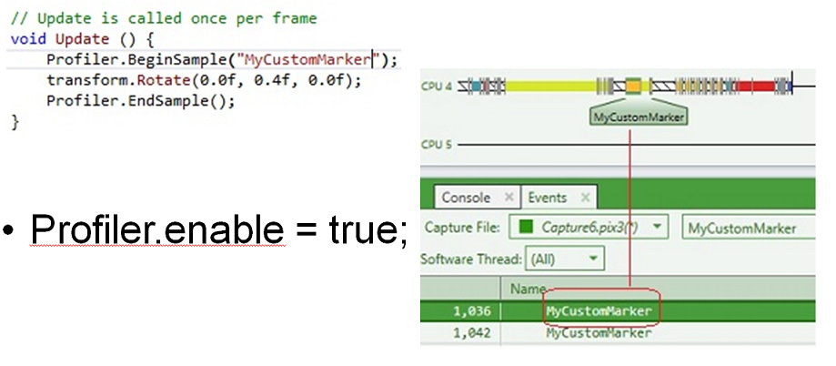

# Profiling

Unity Profiler Network Connection
---------------

The console uses broadcast messages on ports 34997, and communication on ports 4600 and 4601 to communicate with the profiler. Your network or firewalls must allow communication using the ports and broadcast messages.  (Make sure your firewall excludes the UnityEditor executable, particularly if using Windows Firewall).

PIX
---------------

Over and above the usual set of Unity tools, Xbox One offers a rich set of platform specific profiling tools. The most obvious is PIX. To understand what you are seeing in PIX it helps to have a quick overview of Unitys architecture on XBox One.
The following diagram attempts to show Unitys internal structure.

- A dedicate render dispatch thread is running on CPU 0
- You main thread is running on CPU 1
- Everything else is sharing CPUs 2..5

  

Note that CPU 4 and 5 are shared with the system. 
This means that anything that runs on those hardware threads will be sharing cache space with the OS systems. 
The result is that systems running on those threads tend to run slower on average.

When looking at a frame in PIX understanding the previous layout should help you interpret the timeline view. 
Here is a screenshot of a PIX timeline capture. 
The cursor is currently hovering over CPU 0. 

- The large blue section in the diagram is the gfx present 
  as the tooltip is indicating. 
- White hashed areas are parts of our frame that have not 
  yet been wrapped in pix markers but include time dedicated to Unity.
- CPU 1 currently has a behaviour update highlighted. The 
  behaviour update is time spent in the Update function of your scripts. PIX markers can represent a hierarchy, the leaf nodes of the marker heirarchy are what show by default in the timeline view. Many physics calls are instrumented and in this case you can see that the behaviour call spans a yellow section which happens to be a move operation on a static collider. You can see that we have highlighted this as an expensive operation as part of the name of the pix marker.

In addition to the implicit pix markers that are built in to the engine you can insert your own markers from C#. 
C# markers have a higher cost so it is recommended that you avoid adding an excessive amount especially in performance sensitive areas of your game.

- You must turn on support for profile markers in C# by 
  calling Profiler.enable = true.
- Once you have enabled support you should be able to call 
  Profiler.BeginSample and Profiler.EndSample to wrap chunks of code as the following image demonstrates.

